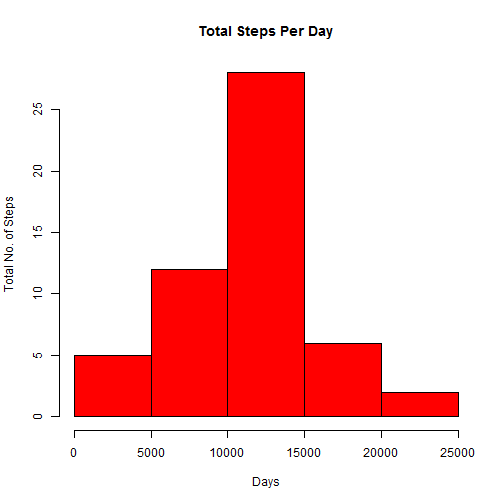
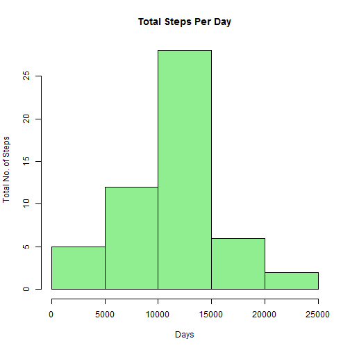
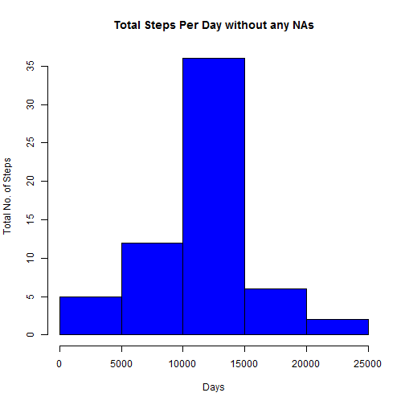

```r
setwd("C:/Data")

url <- 'https://d396qusza40orc.cloudfront.net/repdata%2Fdata%2Factivity.zip'

if (!file.exists('repdata%2Fdata%2Factivity.zip')) {
  download.file(url, 'repdata%2Fdata%2Factivity.zip')
  unzip('repdata%2Fdata%2Factivity.zip', exdir='./data')
}

activity <- read.csv(file = "./data/activity.csv", header = TRUE)
summary(activity)
```

```
##      steps                date          interval     
##  Min.   :  0.00   2012-10-01:  288   Min.   :   0.0  
##  1st Qu.:  0.00   2012-10-02:  288   1st Qu.: 588.8  
##  Median :  0.00   2012-10-03:  288   Median :1177.5  
##  Mean   : 37.38   2012-10-04:  288   Mean   :1177.5  
##  3rd Qu.: 12.00   2012-10-05:  288   3rd Qu.:1766.2  
##  Max.   :806.00   2012-10-06:  288   Max.   :2355.0  
##  NA's   :2304     (Other)   :15840
```

```r
totalStepsPerDay <- aggregate(steps~date, data=activity,FUN=sum, na.rm=TRUE)
```
 


```r
stepsMean <- mean(totalStepsPerDay $steps)
print(stepsMean)
```

```
## [1] 10766.19
```

```r
stepsMedian <- median(totalStepsPerDay $steps)
print(stepsMedian)
```

```
## [1] 10765
```

```r
stepsInterval <- aggregate(steps~interval, data =activity,FUN=mean, na.rm = TRUE)
plot(steps ~ interval, data = stepsInterval, type = "l")
```

 

```r
maximumSteps <- stepsInterval[which.max(stepsInterval$steps), ]$interval
print(maximumSteps)
```

```
## [1] 835
```

Inputing missing values

Create a new dataset that is equal to the original dataset but with the missing data filled in.


```r
totalMissingValues <- sum(is.na(activity$steps))
print(totalMissingValues)
```

```
## [1] 2304
```

```r
#Replace the missing values with mean for 5 minute interval
meanForInterval <- function(interval) {
    stepsInterval[stepsInterval$interval == interval, ]$steps
}
# First load the original dataset
missingFilled <- activity  
counter = 0  
for (i in 1:nrow(missingFilled)) 
{
        if (is.na(missingFilled[i, ]$steps)) 
        {
          missingFilled[i, ]$steps <- meanForInterval(missingFilled[i, ]$interval)
            counter = counter + 1
        }
}
cat("Total ", counter, "NA values were filled.\n\r")
```

```
## Total  2304 NA values were filled.
## 
```
#Make a histogram of the total number of steps taken each day and Calculate and report the mean and median total number of steps taken per day. Do these values differ from the estimates from the first part of the assignment? What is the impact of imputing missing data on the estimates of the total daily number of steps?

 

```
## [1] 10766.19
```

```
## [1] 10766.19
```

Are there differences in activity patterns between weekdays and weekends?

For this part the weekdays() function may be of some help here. Use the dataset with the filled-in missing values for this part.

1. Create a new factor variable in the dataset with two levels - "weekday" and "weekend" indicating whether a given date is a weekday or weekend day.


```r
missingFilled$days = ifelse(as.POSIXlt(as.Date(missingFilled$date))$wday%%6 ==0, "weekend", "weekday")
# For Sunday and Saturday : weekend, Other days : weekday
missingFilled$days = factor(missingFilled$day, levels = c("weekday", "weekend"))
```

The mean value is the same as the one with the pervious assignment where as the median is slightly different.

Make a panel plot containing a time series plot (i.e. type = "l") of the 5-minute interval (x-axis) and the average number of steps taken, averaged across all weekday days or weekend days (y-axis). See the README file in the GitHub repository to see an example of what this plot should look like using simulated data.

 

