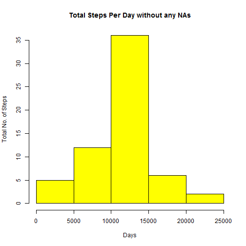
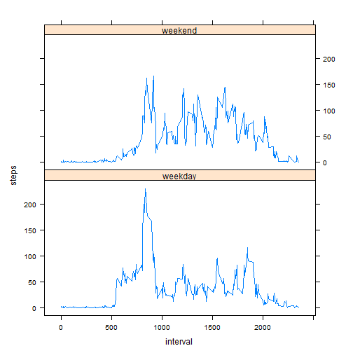

Introduction

It is now possible to collect a large amount of data about personal movement using activity monitoring devices such as a Fitbit, Nike Fuelband, or Jawbone Up. These type of devices are part of the "quantified self" movement - a group of enthusiasts who take measurements about themselves regularly to improve their health, to find patterns in their behavior, or because they are tech geeks. But these data remain under-utilized both because the raw data are hard to obtain and there is a lack of statistical methods and software for processing and interpreting the data.

This assignment makes use of data from a personal activity monitoring device. This device collects data at 5 minute intervals through out the day. The data consists of two months of data from an anonymous individual collected during the months of October and November, 2012 and include the number of steps taken in 5 minute intervals each day.

```r
# Setting the working directory to the local folder which I  will use to #download the data and store the intermediate Rmd, md and  final html files.
setwd("C:/Data")
#Weblink to the data to be downloaded for this assigment.
url <- 'https://d396qusza40orc.cloudfront.net/repdata%2Fdata%2Factivity.zip'
#This script first checks if the zip file already exists, if not it will download the file and unzip it.If it already exists it will reuse the existing file.
if (!file.exists('repdata%2Fdata%2Factivity.zip')) {
  download.file(url, 'repdata%2Fdata%2Factivity.zip')
  unzip('repdata%2Fdata%2Factivity.zip', exdir='./data')
}
#Read the data to a dataframe.
activity <- read.csv(file = "./data/activity.csv", header = TRUE)
#Check the properties of the data.
summary(activity)
```

```
##      steps                date          interval     
##  Min.   :  0.00   2012-10-01:  288   Min.   :   0.0  
##  1st Qu.:  0.00   2012-10-02:  288   1st Qu.: 588.8  
##  Median :  0.00   2012-10-03:  288   Median :1177.5  
##  Mean   : 37.38   2012-10-04:  288   Mean   :1177.5  
##  3rd Qu.: 12.00   2012-10-05:  288   3rd Qu.:1766.2  
##  Max.   :806.00   2012-10-06:  288   Max.   :2355.0  
##  NA's   :2304     (Other)   :15840
```
What is mean total number of steps taken per day?

1. Calculate the total number of steps taken per day ?

```r
#Compute the total steps taken per day using the aggregate function. 
# Note: The missing values have been ignored as suggested by the assignment.
totalStepsPerDay <- aggregate(steps~date, data=activity,FUN=sum, na.rm=TRUE)
```
2. Make a histogram of the total number of steps taken each day
 
3. Calculate and report the mean and median of the total number of steps taken
per day.

```r
#Calculate the mean of the total number of steps per day.
stepsMean <- mean(totalStepsPerDay $steps)
print(stepsMean)
```

```
## [1] 10766.19
```

```r
#Calculate the median of the total number of steps per day.
stepsMedian <- median(totalStepsPerDay $steps)
print(stepsMedian)
```

```
## [1] 10765
```
What is the average daily activity pattern?

```r
#Compute the aggregate steps per interval.
stepsInterval <- aggregate(steps~interval, data =activity,FUN=mean, na.rm = TRUE)
```
1. Make a time series plot (i.e. type = "l") of the 5-minute interval (x-axis) and the average number of steps taken, averaged across all days (y-axis)

 

2. Which 5-minute interval, on average across all the days in the dataset,
contains the maximum number of steps?

```r
maximumSteps <- stepsInterval[which.max(stepsInterval$steps), ]$interval
print(maximumSteps)
```

```
## [1] 835
```
Imputing missing values

Create a new dataset that is equal to the original dataset but with the missing data filled in.

1. Calculate and report the total number of missing values in the dataset (i.e. the total number of rows with NAs)

```r
totalMissingValues <- sum(is.na(activity$steps))
print(totalMissingValues)
```

```
## [1] 2304
```

2. Devise a strategy for filling in all of the missing values in the dataset. The strategy does not need to be sophisticated. For example, you could use the mean/median for that day, or the mean for that 5-minute interval, etc.
3. Create a new dataset that is equal to the original dataset but with the missing data filled in.

```r
#Replace the missing values with mean for 5 minute interval
meanForInterval <- function(interval) {
    stepsInterval[stepsInterval$interval == interval, ]$steps
}
# First load the original dataset
missingFilled <- activity  
counter = 0  
for (i in 1:nrow(missingFilled)) 
{
        if (is.na(missingFilled[i, ]$steps)) 
        {
          missingFilled[i, ]$steps <- meanForInterval(missingFilled[i, ]$interval)
            counter = counter + 1
        }
}
cat("Total ", counter, "NA values were filled.\n\r")
```

```
## Total  2304 NA values were filled.
## 
```
4. Make a histogram of the total number of steps taken each day and Calculate and report the mean and median total number of steps taken per day. Do these values differ from the estimates from the first part of the assignment? What is the impact of imputing missing data on the estimates of the total daily number of steps?

 

```
## [1] 10766.19
```

```
## [1] 10766.19
```
The mean value is the same as the one with the pervious assignment where as the median is slightly different.

Are there differences in activity patterns between weekdays and weekends?

For this part the weekdays() function may be of some help here. Use the dataset with the filled-in missing values for this part.

1. Create a new factor variable in the dataset with two levels - "weekday" and "weekend" indicating whether a given date is a weekday or weekend day.


```r
missingFilled$days = ifelse(as.POSIXlt(as.Date(missingFilled$date))$wday%%6 ==0, "weekend", "weekday")
# For Sunday and Saturday : weekend, Other days : weekday
missingFilled$days = factor(missingFilled$day, levels = c("weekday", "weekend"))
```
2. Make a panel plot containing a time series plot (i.e. type = "l") of the 5-minute interval (x-axis) and the average number of steps taken, averaged across all weekday days or weekend days (y-axis).

 

Hope you enjoyed the report. Have a good day !
